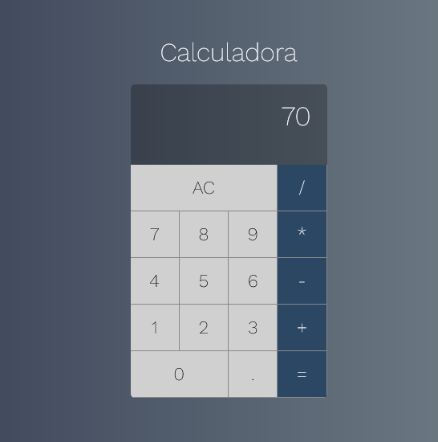

_This README.md file is in English and Portuguese. // Esse arquivo README.md está em Inglês e Português._

# PT: Calculadora em React.js

 ⚠️ _Isso foi criado enquanto eu seguia o projeto de Calculadora do curso de React e Redux do Leonardo Moura Leitão. O curso está [disponível na Udemy aqui](https://www.udemy.com/course/react-redux-pt/)_. ⚠️

_Printscreen da versão final acima._

## Caderno de Anotações

"**Na medida do possível**, usar componentes **sem estado**.

Isso porque um componente sem estado trabalha de forma menos complexa: ele recebe parâmetros de entrada e, a partir deles, renderiza aos componentes. Ele não muda com o tempo e fica mais fácil de trabalhar assim. Eventualmente, claro, alguns componentes precisam de estado. Deixa pra esses caras, os essenciais, usar o estado."

Com comentários no código para lembrete e informação.

_Fim._

# Calculator in React.js

⚠️ _This was done as I followed up a calculator project from the React and Redux course by Leonardo Moura Leião. You can find the course [on Udemy here](https://www.udemy.com/course/react-redux-pt/)._ ⚠️

## Notes

"**As best as you can**, you should you **stateless components**. 

Because a stateless component works in a less complex way: it receives entry parameters and render them to components. It doesn't change with time and so it's easier to work this way. Of course, eventually some components will have to be stateful. Leave it to these guys to use the "state" aspect of it."

_The end._